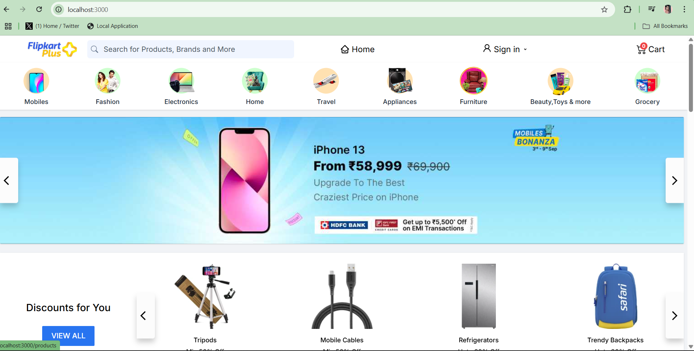

# Flickart - MERN eCommerce Project (Flipkart Clone)

This is a Flipkart-like eCommerce project built by **Tannu Kumari** using the MERN (MongoDB, Express.js, React.js, Node.js) stack. It demonstrates the core features of a modern online shopping platform, including authentication, payment integration, admin dashboard, and more.

## Table of Contents

- [Features](#features)
- [Requirements](#requirements)
- [Setup](#setup)
- [Usage](#usage)
- [Environment Variables](#environment-variables)
- [Test Users](#test-users)
- [Contributing](#contributing)
- [License](#license)

---

## Features

- 🔐 **User Authentication & Authorization**  
  JWT-based login/register system with protected routes.

- 🛒 **Product Catalog & Search**  
  Browse products by category, name, or keyword.

- 🛍️ **Shopping Cart**  
  Add/remove items, view cart, save for later, and checkout.

- 💳 **Stripe Payment Integration**  
  Secure online payment via credit/debit cards.

- 📦 **Order History**  
  View previous orders, delivery status, and details.

- 🧑‍💼 **Admin Dashboard**  
  Manage products, categories, and orders. Route: `/dashboard/admin`.

- 🌐 **Responsive Design**  
  Built with **Tailwind CSS** and **Material UI** for all devices.

- 🔒 **Password Security**  
  All user passwords are hashed using Bcrypt.

- ☁️ **Cloudinary Integration**  
  Efficient image storage and retrieval for product images.

---

## Requirements

Ensure you have the following installed:

- Node.js and npm
- MongoDB (local or Atlas)
- Stripe account
- Cloudinary account

---

## Setup

### 1. Clone the Repository

```bash
git clone https://github.com/Tannu067/Flickart-Flipkart-Clone.git
cd Flickart-Flipkart-Clone


### 2. Setup the Backend

```bash
cd backend
npm install
# Add your config.env file here
npm run dev

### 3. Setup the Frontend

```bash
cd ../client
npm install
# Add your .env file here
npm run dev

### 4. Run the App
Open browser at: http://localhost:3000

Admin Dashboard: http://localhost:3000/dashboard/admin


## Environment Variables

### Backend (backend/.env)
PORT=8080
MONGODB_URI=YOUR_MONGODB_URI
JWT_SECRET=YOUR_SECRET
CLOUD_NAME=YOUR_CLOUDINARY_NAME
CLOUD_API_KEY=YOUR_CLOUDINARY_KEY
CLOUD_SECRET=YOUR_CLOUDINARY_SECRET
STRIPE_SECRET_KEY=YOUR_STRIPE_SECRET

### Frontend (client/.env)

VITE_API=http://localhost:8080
VITE_STRIPE_PUBLISH_KEY=YOUR_PUBLISHABLE_KEY
VITE_SERVER_URL=http://localhost:8080

##Test Users
👤 User

Email: test@test.com

Password: test123

🛠 Admin

Email: store@flipkart.com

Password: admin123

## Contributing
Contributions are welcome! Feel free to submit pull requests or open issues to enhance the project.

## License
This project is licensed under the Apache 2.0 License
Copyright © 2025 Tannu Kumari


## Screenshots

### Home Page


### 🛒 Cart Page


### 🔚 Footer Section


### 🔐 Sign-in Page


